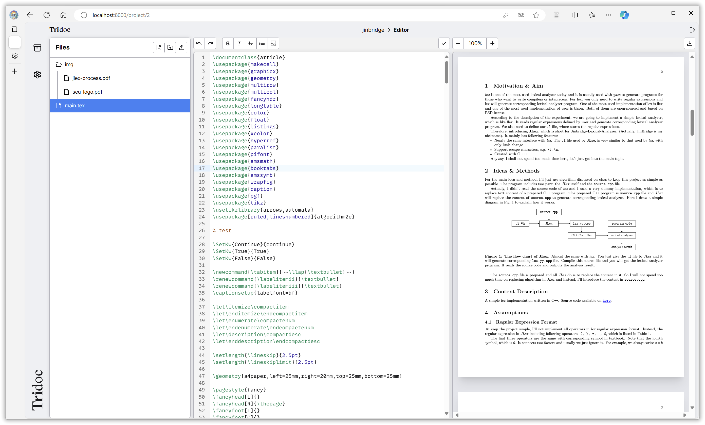

# Tridoc: An Online $\LaTeX$ editor

[](https://github.com/tridoc-dev/tridoc/actions/workflows/coverage-test.yaml)
[](https://codecov.io/github/tridoc-dev/tridoc)

## ✨ Deploy

### Install `php` and `composer`

- For Windows users, installing php with `scoop` is recommended, by `scoop install php`.
- For macOS users, install homebrew first and then `brew install php`.

The package manager `composer` is required and you may install it with `scoop` / `homebrew` or download a phar archive as instructed by the official guide. Choose the way you may prefer.

### Install `node` and `pnpm`

Please refer to [NodeJS](https://nodejs.org/en) and [pnpm](https://pnpm.io/) for installation guide.

### Install PostgreSQL and Docker

Please refer to [PostgreSQL](https://www.postgresql.org/) and [docker](https://docs.docker.com/) for installation guide.

### Setup and run

```bash
composer install
pnpm install
cp .env.example .env

pnpm run dev
```

## 📸 Screenshot


